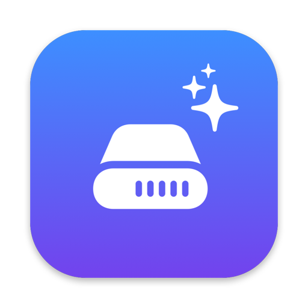
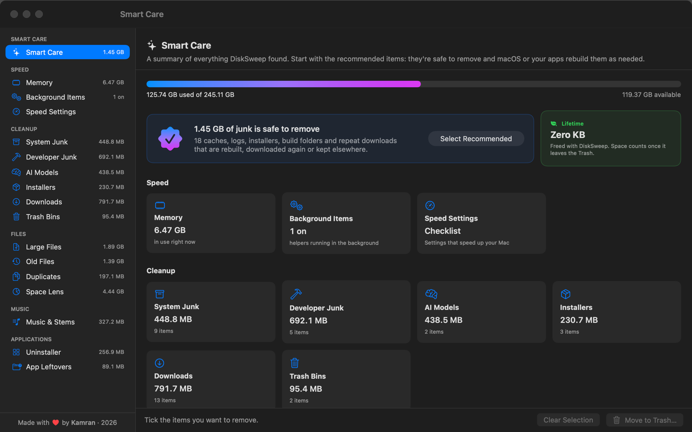
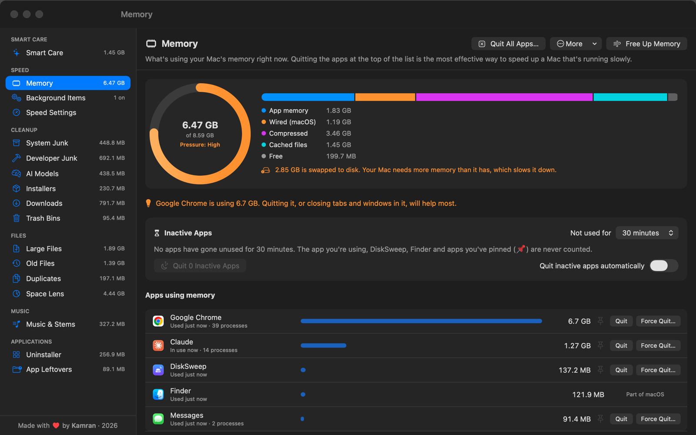
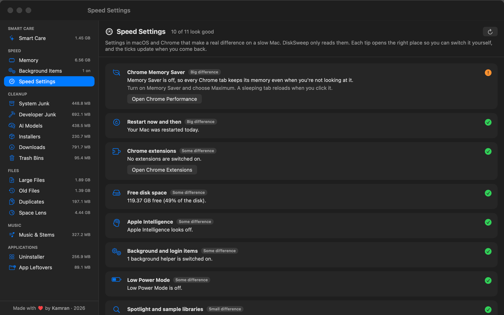
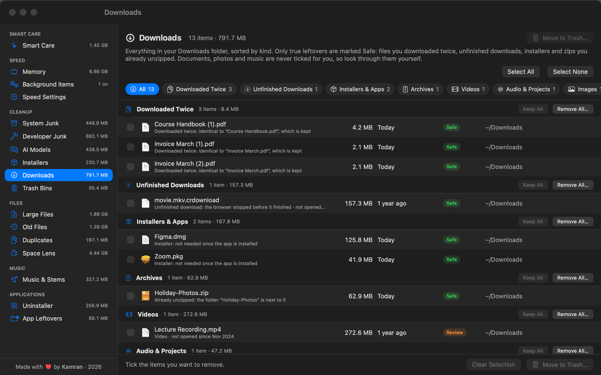
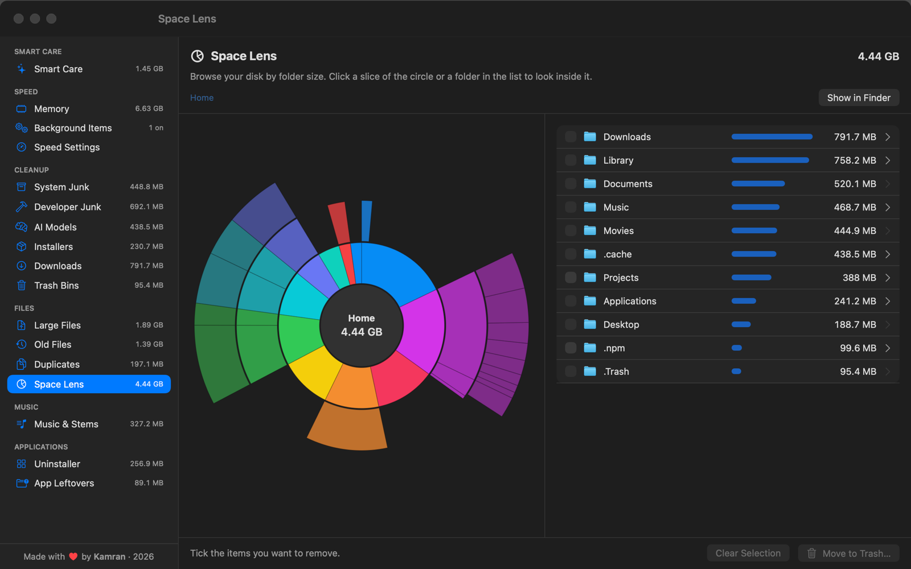
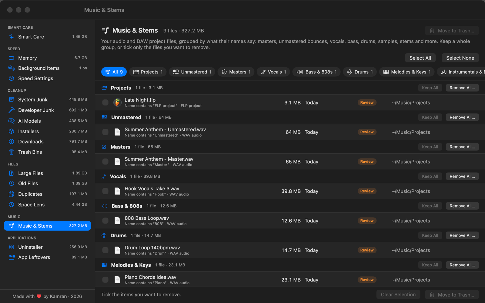
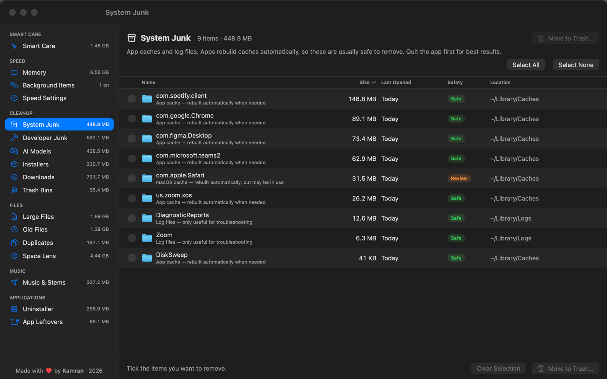
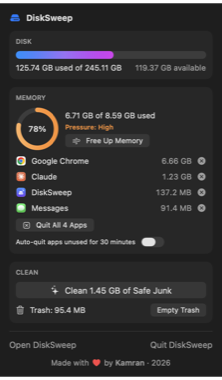

<div align="center">



# DiskSweep

**Clean up your Mac and make it fast again.**
A free, open-source disk cleaner and speed tool for macOS, in the spirit of CleanMyMac.

[](https://github.com/kamb205/DiskSweep/releases/download/v1.0/DiskSweep-1.0.dmg)




[Features](#features) · [Screenshots](#screenshots) · [Install](#download--install) · [Safety](#safety) · [FAQ](#faq) · [Build](#build-from-source)

</div>

## Why DiskSweep?

- **One click to reclaim space.** Smart Care finds caches, logs, leftover installers, build folders and repeat downloads that are safe to remove, and ticks them for you.
- **Actually speeds up a slow Mac.** See what's eating your memory, quit forgotten apps in one go, switch off background helpers, and follow a checklist of settings that really make a difference.
- **Safe by design.** Nothing is deleted outright. Everything goes to the Trash so you can put it back, and your documents, photos, mail, passwords, iCloud files and macOS itself are never offered for removal.
- **Free, native and private.** A small SwiftUI app. No account, no subscription, no tracking. Your files never leave your Mac.

## Features

### Speed

| | |
|---|---|
| **Memory** | A live breakdown like Activity Monitor, a swap warning, the app using the most memory, and **Free Up Memory**, which quits apps you haven't used recently and shows how much was freed. Optional auto-quit for inactive apps, with a 📌 Keep Open list. |
| **Speed Settings** | A checklist of settings that make a real difference (Chrome Memory Saver, extensions, restarts, free space, Spotlight, Apple Intelligence, Low Power Mode, transparency and motion). DiskSweep only *reads* them, and each tip opens the right place to change it yourself. |
| **Background Items** | Switch off launch agents and helpers that apps leave running, with leftovers from deleted apps flagged. |

### Cleanup

| | |
|---|---|
| **System Junk** | App caches, logs, old iPhone backups and Mail attachment copies. |
| **Developer Junk** | npm, pip, Homebrew, Cargo and Gradle caches, Xcode data, and `node_modules`, `target`, `.venv` and other build folders (only when the project's manifest is there). |
| **AI Models** | Ollama, Hugging Face, LM Studio, PyTorch and Whisper downloads. |
| **Installers** | `.dmg`, `.pkg` and `.iso` files you no longer need. |
| **Downloads** | Everything in your Downloads folder, sorted by kind. Files you downloaded twice, unfinished downloads and zips you already unzipped are flagged as safe. |
| **Trash Bins** | See what's in the Trash, put things back or empty it. |

### Files & apps

| | |
|---|---|
| **Large & Old Files** | Your biggest files, and the ones you haven't opened in months. |
| **Duplicates** | Byte-for-byte identical files. One copy is always kept. |
| **Space Lens** | An interactive sunburst map of what's taking up your disk. |
| **Music & Stems** | For producers: audio and DAW projects grouped into masters, unmastered bounces, vocals, 808s, drums, stems, samples and more. |
| **Uninstaller** | Removes an app together with its caches, preferences and data. |
| **App Leftovers** | Data left behind by apps you've already deleted. |

Plus a **menu bar panel** for memory, quick cleaning and the Trash, and keyboard shortcuts for every page (⌘1–⌘9).

## Screenshots

<table>
  <tr>
    <td><br><b>Memory</b>: see what's slowing your Mac down</td>
    <td><br><b>Speed Settings</b>: tips that really help</td>
  </tr>
  <tr>
    <td><br><b>Downloads</b>: repeat and forgotten downloads</td>
    <td><br><b>Space Lens</b>: map your disk</td>
  </tr>
  <tr>
    <td><br><b>Music & Stems</b>: built for producers</td>
    <td><br><b>System Junk</b>: caches and logs</td>
  </tr>
</table>

<p align="center"><br><b>Menu bar panel</b></p>

<sub>Screenshots use a made-up demo folder, not real files.</sub>

## Download & install

**Requirements:** macOS 26 Tahoe or later, on Apple silicon (M1 and newer) or any Intel Mac that runs Tahoe.

1. Download **[DiskSweep-1.0.dmg](https://github.com/kamb205/DiskSweep/releases/download/v1.0/DiskSweep-1.0.dmg)** (2.7 MB), or pick it from the [latest release](https://github.com/kamb205/DiskSweep/releases/latest).
2. Open it and drag **DiskSweep** into **Applications**.
3. Open DiskSweep from Applications.

### "Apple could not verify DiskSweep…"

DiskSweep is free and isn't distributed through Apple's paid developer program, so macOS asks you to confirm the first time you open it:

1. Click **Done** on the message.
2. Open **System Settings → Privacy & Security**.
3. Scroll down to the message about DiskSweep and click **Open Anyway**, then enter your password.

You only need to do this once.

### Full Disk Access

To see your whole disk (including the Trash, Mail and app data), DiskSweep needs **Full Disk Access**. The start screen walks you through it: click **Open Privacy Settings**, switch DiskSweep on, then click **Relaunch**.

## Safety

DiskSweep is built so you can't accidentally break your Mac:

- **Everything goes to the Trash first.** Only the Trash Bins page erases files, and only after you confirm.
- **Only true junk is marked Safe** and pre-selected. Anything that might matter is marked **Review** or **Careful** and is never ticked for you.
- **Protected locations can never be removed:** your Keychain, preferences, Mail, Messages, Photos libraries, iCloud Drive, Git history, Apple's apps and macOS itself. These rules are checked again at the moment of removal.
- **Programs and tool installs are left alone.** Files inside Node.js, Python, Conda, editor extensions and other tools are never listed.
- **Apps are quit politely**, like ⌘Q, so anything unsaved asks you to save first. Your music apps, DAWs and call apps are on the Keep Open list by default.

## Privacy

DiskSweep runs entirely on your Mac. It has no account, no analytics and no tracking, and it never uploads your files or file names anywhere. Its only internet connection loads public, credited cat photos from Wikimedia Commons to keep you company while a scan runs.

## FAQ

<details>
<summary><b>Will DiskSweep delete something important?</b></summary>

No. Everything you remove goes to the Trash first, so you can put it back. Only true junk (caches, logs, installers, build folders, repeat downloads) is pre-selected, and protected places like your Keychain, Mail, Photos, iCloud Drive and macOS itself can't be removed at all. See [Safety](#safety).
</details>

<details>
<summary><b>Why does macOS say it "could not verify" DiskSweep?</b></summary>

DiskSweep is free and isn't signed through Apple's paid developer program, so macOS asks you to confirm once. Open System Settings → Privacy & Security and click **Open Anyway**. The full source code is here for anyone to check.
</details>

<details>
<summary><b>Why does it need Full Disk Access?</b></summary>

macOS hides the Trash, Mail attachments and most app data from apps unless you allow it. Without access DiskSweep would miss a lot of junk. Your files are only read on your Mac and never uploaded.
</details>

<details>
<summary><b>Can it really make my Mac faster?</b></summary>

On Macs with 8 GB of memory, slowness usually comes from memory running out, not a full disk. DiskSweep shows which apps are using memory, quits the ones you've forgotten about, and points out the settings that matter (like Chrome's Memory Saver). It's honest about what doesn't help: "RAM boosters" and "repair permissions" don't speed up modern Macs, so you won't find them here.
</details>

<details>
<summary><b>Does it work on Intel Macs?</b></summary>

Yes. It's a universal app for Apple silicon and Intel. It needs macOS 26 Tahoe, so any Mac that can run Tahoe can run DiskSweep.
</details>

<details>
<summary><b>How do I uninstall DiskSweep?</b></summary>

Quit it, then drag **DiskSweep** from Applications to the Trash. To remove its saved scan and settings too, delete `~/Library/Application Support/DiskSweep` and `~/Library/Preferences/com.kamranbharaj.DiskSweep.plist`.
</details>

## Build from source

You need macOS 26 and the Xcode Command Line Tools (`xcode-select --install`).

```bash
git clone https://github.com/kamb205/DiskSweep.git
cd DiskSweep
./build.sh            # builds a universal DiskSweep.app and dist/DiskSweep-1.0.dmg
./build.sh --install  # also installs it into /Applications
```

The project is a single SwiftPM executable target in `Sources/DiskSweep`. `Scripts/make_readme_screenshots.sh` regenerates the screenshots above from a made-up demo folder.

## Contributing

Bug reports and ideas are welcome. Please [open an issue](https://github.com/kamb205/DiskSweep/issues). Pull requests are welcome too. See [CONTRIBUTING.md](CONTRIBUTING.md), and please keep the safety rules above intact. If you find a security problem, see [SECURITY.md](SECURITY.md).

If DiskSweep helped you, a ⭐ on this repo helps other people find it.

## License

[MIT](LICENSE) © 2026 Kamran

<div align="center"><sub>Made with ♥ by Kamran</sub></div>
